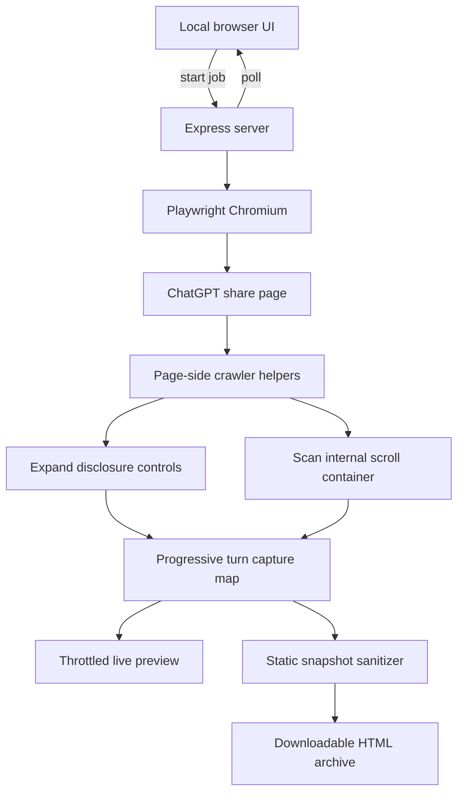

# ChatGPT Conversation Crawler

A local Node.js/Playwright application for turning a ChatGPT **shared conversation** into a readable, script-free static HTML archive.

The crawler is designed for long shared conversations where ordinary **Save page** / MHTML capture is incomplete because ChatGPT lazily mounts content, virtualizes older turns, and keeps reasoning/tool sections collapsed behind user-facing disclosure controls.

It specifically handles patterns such as:

```html
<button
  type="button"
  aria-label="Implemented ellipse-based horizon detection and inspected detection block indentation"
  aria-controls="_r_19h_"
  aria-expanded="false">
</button>
```

The generated `aria-label` is not the important part. The crawler uses the disclosure relationship (`aria-expanded="false"` + `aria-controls`) inside conversation turns, opens the control, waits for the controlled content to mount, and then captures the richer turn.

> [!IMPORTANT]
> This project captures content that the ChatGPT **share page actually exposes to an ordinary browser** after normal scrolling and user-visible expansion. It does not recover private model chain-of-thought, hidden application state, React internals, account-only data, or network payloads that are not exposed by the shared page.

## Features

- Accepts only `https://chatgpt.com/share/...` URLs.
- Opens the share in a clean Playwright-controlled Chromium browser.
- Detects ChatGPT's internal vertical scroll container instead of assuming `window` is the scroller.
- Scans the conversation in multiple directions to trigger lazy loading and virtualization boundaries.
- Progressively retains conversation turns so content is not lost when ChatGPT unmounts old DOM nodes.
- Expands native `<details>` elements.
- Expands conversation disclosure controls with `aria-expanded="false"` and `aria-controls`, regardless of their generated `aria-label`.
- Expands parent controls such as **Worked for ...**, **Thought**, **Thinking**, and **Reasoning** even when they do not have `aria-controls`, because those parents can mount nested tool/reasoning rows only after being opened.
- Avoids obvious menu controls such as `aria-haspopup` and `[role="menuitem"]`.
- Preserves code-oriented semantic markup such as `<pre>` and `<code>`.
- Retains the richest version of each virtualized conversation turn encountered during the crawl.
- Provides a live progress dashboard for long-running captures.
- Distinguishes **worker heartbeat** from **last substantive progress** so a slow crawl is easier to distinguish from a stalled process.
- Provides a separate live-preview window containing the archive captured so far.
- Supports cancellation.
- Includes a dedicated oldest-message convergence phase for very long conversations.
- Produces a static, script-free HTML file suitable for offline reading or further conversion.

## Requirements

- Windows, macOS, or Linux
- Node.js **20 or newer**
- Internet access while crawling the ChatGPT share URL
- Enough memory for Chromium plus the progressively retained conversation HTML

The Windows launchers are the most thoroughly exercised path because this project was developed against Windows-saved ChatGPT pages and long Windows capture runs.

## Quick start on Windows

### 1. Install Node.js

Install Node.js 20+ with npm included. Then open or extract this repository into a normal folder.

### 2. Run the one-time setup

Double-click:

```text
setup-windows.bat
```

The setup script:

1. Finds the active `node.exe`.
2. Resolves the `npm.cmd` installed next to that Node installation rather than trusting an accidental project-local npm package.
3. Runs `npm install`.
4. Installs Playwright Chromium by invoking Playwright's CLI directly with Node.

This behavior exists because an earlier launcher could accidentally resolve npm through a broken path such as `node_modules\npm\bin\npm-cli.js` on Windows.

### 3. Start the application

Double-click:

```text
start-windows.bat
```

The launcher starts the server directly with:

```text
node server.mjs
```

It deliberately does **not** use `npm start` at runtime.

Open:

```text
http://localhost:3000
```

The launcher also attempts to open that page automatically.

## Manual setup

From PowerShell, Command Prompt, bash, or another shell in the repository directory:

```bash
npm install
node node_modules/playwright/cli.js install chromium
node server.mjs
```

Then open `http://localhost:3000`.

You can also use `npm start` manually after dependencies are installed; the Windows launcher itself bypasses npm for startup to avoid the Windows resolution problem described above.

## Usage

1. In ChatGPT, use **Share** on the conversation you want to archive.
2. Copy the generated URL. It should look like:

   ```text
   https://chatgpt.com/share/...
   ```

3. Paste it into **ChatGPT Share Archiver**.
4. Select **Start archive**.
5. Keep the main status page open while the crawler works.
6. Optionally select **Open live preview** to inspect the content captured so far.
7. When the job reaches **Complete**, download the generated static HTML file.

For a long conversation, the crawl can legitimately take a substantial amount of time because it repeatedly scrolls, waits for asynchronous rendering, expands mounted disclosures, and revisits the oldest edge until it converges.

## What the progress page means

The application intentionally avoids presenting the current scroll percentage as a true overall completion percentage.

ChatGPT can behave like this during lazy loading:

```text
known scroll height: 45,000 px
        ↓ older/new content mounts
known scroll height: 82,000 px
        ↓ more content mounts
known scroll height: 126,000 px
```

A crawler can therefore be at 90% of the **currently known** scroll range and then appear to move backward when ChatGPT adds more content.

The more meaningful coarse phases are:

```text
Preparing crawler
        ↓
Pass 1/3 — downward
        ↓
Pass 2/3 — upward
        ↓
Verifying oldest messages
        ↓
Pass 3/3 — downward
        ↓
Final expansion sweep
        ↓
Building final static page
        ↓
Complete
```

The dashboard also reports:

- conversation turns retained;
- disclosures confirmed expanded;
- attempted expansion clicks;
- `<pre>` blocks captured;
- `<code>` elements captured;
- disclosures that could not be confirmed expanded;
- current scan pass and direction;
- position within the currently mounted scroll range;
- worker heartbeat age;
- age of the last substantive progress event.

### Worker heartbeat vs. substantive progress

These are deliberately separate signals.

**Worker heartbeat** means the Node/Chromium job is still responding.

**Last substantive progress** means something meaningful changed: a phase changed, a new turn was retained, an expansion occurred, a code-block count changed, and so on.

A healthy heartbeat with unchanged progress can be normal while ChatGPT is asynchronously loading or the crawler is waiting for a stability check. A stale heartbeat is a stronger indication that the browser or Node process may actually be stuck.

## How the crawler works



### 1. URL validation

`server.mjs` accepts only HTTPS URLs on `chatgpt.com` / `www.chatgpt.com` whose path begins with `/share/`.

That restriction is intentional. The server is not meant to become an arbitrary URL fetcher or local-network proxy.

### 2. Chromium renders the real share page

The server launches Playwright Chromium with JavaScript enabled and loads the shared page. This is necessary because a plain browser-side `fetch()` from an unrelated local page cannot reliably load and inspect ChatGPT's cross-origin application DOM, and because the content itself is dynamically rendered.

The crawler uses a clean browser context. It does not import the user's normal ChatGPT login session.

### 3. Conversation-turn scoping

The crawler focuses on elements matching:

```css
section[data-testid^="conversation-turn-"]
```

This keeps expansion logic focused on actual conversation content instead of indiscriminately clicking navigation, account, model-selection, or other surrounding interface controls.

### 4. Disclosure expansion

There are two important categories.

#### Controlled disclosures

Within a conversation turn, a control like this is considered expandable:

```html
<button
  aria-expanded="false"
  aria-controls="_r_19h_"
  aria-label="Implemented ellipse-based horizon detection and inspected detection block indentation">
</button>
```

The crawler does not require the label to contain the word “Thought”. Generated labels can describe arbitrary tool activity. The structural accessibility state is the useful signal.

Controls with `aria-haspopup` or menu semantics are excluded from this rule.

#### Parent reasoning controls

Some parents can look more like:

```html
<button aria-expanded="false">
  Worked for 3m 38s
</button>
```

They may not expose `aria-controls`. Opening the parent can cause React to mount a nested reasoning/tool tree. The crawler therefore recognizes parent labels beginning with forms of:

- `Worked for`
- `Thought`
- `Thinking`
- `Reasoning`

After opening a parent, it rescans the newly mounted content and expands controlled disclosures inside it.

Each click is followed by a delay and confirmation attempt. Controls that cannot be confirmed open after repeated attempts are recorded as failures rather than silently assumed successful.

### 5. Progressive capture protects against virtualization

Long ChatGPT conversations may virtualize the DOM. A turn visible near the top can disappear from the live document once the browser scrolls far enough away.

For that reason, the crawler does **not** wait until the very end and simply copy the current page DOM.

Instead, every encountered conversation turn is cloned into an in-page capture map keyed by its conversation-turn ID. When the same turn is encountered later in a richer state, the stored copy is replaced.

The richness score favors, in order:

1. a turn with no remaining detected collapsed disclosures;
2. more `<pre>` blocks;
3. more `<code>` elements;
4. more visible text;
5. a larger retained HTML representation.

This is why a turn first seen in collapsed form can later be replaced by a version containing the mounted tool output or code block.

### 6. Lazy-loading scan strategy

The crawler finds the scrollable ancestor around `#thread` / `main` rather than assuming the document itself scrolls.

The current v1.3 sequence is:

1. **Pass 1 — downward**: discover content while moving toward the currently known bottom.
2. **Pass 2 — upward**: return through the virtualized history with smaller upward steps.
3. **Verifying oldest messages**: repeatedly re-enter the top edge until old-message loading converges.
4. **Pass 3 — downward**: traverse everything discovered after the oldest-message probe.
5. **Final expansion sweep**: open remaining mounted disclosures and perform one last capture.

Directional scans permit up to 1,200 steps. Upward motion uses smaller increments than downward motion to reduce the risk of skipping a lazy-loading boundary.

## Oldest-message convergence in v1.3

A previous live-preview version could reach `scrollTop = 0`, observe a few unchanged samples, and move on before ChatGPT asynchronously prepended all old turns. Long histories exposed this race condition.

v1.3 adds a dedicated **Verifying oldest messages** phase.

At the top edge it monitors a signature containing:

- the oldest conversation-turn ID retained so far;
- the first conversation-turn ID currently mounted in the DOM;
- retained turn count;
- current scroll height;
- retained `<pre>` count;
- retained `<code>` count;
- expansion click count;
- confirmed expansion count.

The crawler requires **12 consecutive unchanged top checks** before considering the oldest region converged. If any of those signals changes, the quiet counter resets.

Between checks it deliberately moves a short distance away from the top and back again. This re-crosses the edge and can retrigger `IntersectionObserver` or virtualization logic that may not fire again if the browser simply remains parked at `scrollTop = 0`.

During this phase, expensive full live-preview reconstruction is paused. Lightweight progress/heartbeat updates continue, but Chromium gets priority for loading and mounting the oldest turns.

The status detail may look like:

```text
Oldest retained: conversation-turn-55 · mounted first: conversation-turn-55 · 7/12 quiet top checks
```

If an older turn suddenly appears, the IDs/counters change and the quiet count returns to zero.

## Live preview

The main page opens or can manually open a separate **Live archive preview** window.

The preview is built from the progressive capture map, not from whichever subset of turns happens to be mounted in ChatGPT at that instant.

Preview reconstruction is throttled because serializing a very large accumulated conversation is expensive. It is also paused during the v1.3 oldest-message convergence probe, where rendering work could interfere with lazy loading.

The preview is diagnostic. The final downloaded archive is rebuilt once more after the crawler finishes.

## Static export

`src/snapshot.mjs` converts the retained turn clones into a script-free document intended for reading rather than replaying the ChatGPT application.

The exporter:

- sorts retained turns by conversation-turn number;
- removes scripts and application-only interactive content;
- removes dialogs, menus, forms, inputs, canvases, iframes, and SVG elements;
- removes hidden nodes captured with `hidden` / `aria-hidden="true"`;
- normalizes links and makes them inert with respect to the original app;
- converts useful reasoning/status button labels to static text;
- removes copy/model/action buttons that are meaningless in a static archive;
- strips most application attributes and event-oriented markup;
- preserves ordinary prose, lists, tables, headings, images, `<pre>`, and `<code>` content;
- adds archive metadata such as source URL, archive time, retained turn count, and expansion diagnostics.

### Images

Images are left as resolved external URLs. They are **not** embedded as base64/data URLs in the HTML.

That keeps archive files smaller, but it also means an image can stop displaying later if its source URL expires or becomes unavailable.

## Project layout

```text
.
├── package.json
├── server.mjs
├── setup-windows.bat
├── start-windows.bat
├── public/
│   ├── index.html
│   └── preview.html
└── src/
    ├── crawler.mjs
    └── snapshot.mjs
```

### `server.mjs`

- validates share URLs;
- creates and tracks in-memory archive jobs;
- launches/owns Playwright Chromium;
- records heartbeat and progress state;
- throttles preview creation;
- serves status, preview, cancel, and final-download endpoints.

### `src/crawler.mjs`

Runs the page-side capture logic and orchestrates scrolling, expansion, progressive turn retention, scan phases, cancellation checks, and oldest-message convergence.

### `src/snapshot.mjs`

Transforms the progressive capture map into the readable static HTML output.

### `public/index.html`

The local control/status UI. It starts jobs and polls the server for live progress.

### `public/preview.html`

The separate live preview window. It polls the current job and refreshes only when the captured-content signature changes, attempting to preserve the reader's approximate scroll position.

### Windows batch files

- `setup-windows.bat` installs dependencies and Playwright Chromium with defensive npm resolution.
- `start-windows.bat` launches `node server.mjs` directly and opens the local UI.

## HTTP endpoints

The browser UI currently uses these local endpoints:

| Method | Endpoint | Purpose |
|---|---|---|
| `POST` | `/api/archive/start` | Start a new archive job |
| `GET` | `/api/archive/status/:id` | Poll phase, counters, heartbeat, and state |
| `GET` | `/api/archive/preview/:id` | Retrieve the latest generated preview HTML |
| `GET` | `/api/archive/download/:id` | Download the final HTML after completion |
| `POST` | `/api/archive/cancel/:id` | Request cancellation |

Jobs and generated HTML are held **in memory**. Restarting the Node process discards active/completed job state that has not already been downloaded.

## Security model

This tool is intended to run on a trusted machine for a URL that the user deliberately supplies.

Relevant design choices:

- only HTTPS `chatgpt.com/share/...` URLs are accepted;
- arbitrary hosts are rejected, limiting the server's usefulness as an SSRF/general fetch proxy;
- the Playwright context is clean and does not import the user's normal browser profile;
- the final HTML contains no copied ChatGPT scripts;
- final external links are opened as ordinary links rather than replaying application actions.

Do not expose the local server port to untrusted networks. The application has no user-authentication layer because it is designed as a local utility.

## What this project does not do

It does not:

- authenticate into a private ChatGPT account;
- bypass workspace/share access restrictions;
- recover content that the share page does not expose to the browser;
- extract private chain-of-thought or model-internal reasoning;
- inspect hidden React state or private API payloads to manufacture missing content;
- preserve ChatGPT as an interactive application;
- guarantee that externally hosted images remain available indefinitely;
- guarantee compatibility with future ChatGPT DOM changes without maintenance.

## Troubleshooting

### `Cannot find module ... node_modules\npm\bin\npm-cli.js`

Use the current Windows scripts. `start-windows.bat` no longer calls npm; it starts the server directly with Node. `setup-windows.bat` resolves the npm installation paired with the active Node executable.

If the current Node installation itself has no valid `npm.cmd`, reinstall Node.js with npm included.

### Playwright says Chromium is missing

Run:

```text
setup-windows.bat
```

or manually:

```bash
node node_modules/playwright/cli.js install chromium
```

### The UI is active but the counters have not changed

Check **Worker heartbeat**.

- Recent heartbeat + old substantive-progress time: the crawler is alive and may be waiting on ChatGPT or a convergence check.
- Stale heartbeat: Chromium/Node may actually be stalled.

The live preview can also show the latest retained state.

### The oldest messages are still missing

Make sure you are running v1.3 or newer. Watch for the **Verifying oldest messages** phase and confirm that the quiet top-check count reaches `12/12`.

If the first retained turn is still not the true beginning after that, ChatGPT may have changed its lazy-loading/virtualization behavior. Capture the relevant saved page/DOM pattern and adjust the scroll-root or convergence signals rather than simply forcing hidden HTML visible.

### Some code/tool section remains collapsed

The crawler only expands controls inside conversation turns that look structurally like disclosures or recognized reasoning parents. It intentionally avoids blindly clicking every button on the page.

Inspect whether the control still exposes `aria-expanded`, `aria-controls`, or another user-facing disclosure relationship. Frontend changes can require updating `isDisclosure()` in `src/crawler.mjs`.

### An image is missing in the final HTML

The current exporter references external image URLs instead of embedding image bytes. The source may be expired, access-controlled, or no longer reachable.

## Development

Start the server:

```bash
npm start
```

Syntax-check the main JavaScript modules:

```bash
node --check server.mjs
node --check src/crawler.mjs
node --check src/snapshot.mjs
```

When modifying the crawler, test at least these cases:

1. a short conversation with no reasoning/tool disclosures;
2. a conversation containing `<pre><code>` blocks;
3. a collapsed `aria-controls` disclosure whose `aria-label` is a generated activity summary;
4. a collapsed **Worked for ...** parent that mounts nested disclosures;
5. a long conversation that virtualizes turns;
6. a conversation where older turns appear asynchronously only after repeatedly reaching the top;
7. cancellation during a long scan;
8. live preview while counters are changing.

## Version history

### v1.0.0 — initial share archiver

- First local Express/Playwright implementation.
- Restricted input to ChatGPT share URLs.
- Lazy-loaded by scrolling until document height stabilized.
- Expanded native details and conservatively label-matched visible controls.
- Exported a readable static HTML document with code blocks retained.

### v1.1.0 — disclosure structure and virtualization

Developed after inspecting saved ChatGPT MHTML examples.

- Switched from label-only expansion to conversation-scoped structural disclosure detection.
- Added support for arbitrary generated labels on `aria-controls` disclosures.
- Added **Worked for / Thought / Thinking / Reasoning** parent expansion.
- Switched to ChatGPT's internal scroll container.
- Added multi-direction scanning.
- Added progressive turn capture so virtualized turns survive later DOM unmounting.
- Added richer static-export diagnostics and Windows launchers.

### v1.1.1 — Windows launcher fix

- Fixed startup on systems where `npm` resolved to a broken project-local package.
- Runtime startup now calls `node server.mjs` directly.
- Setup resolves `npm.cmd` alongside the active Node installation.
- Playwright browser installation no longer depends on `npx`.

### v1.2.0 — live status and preview

- Replaced the single long blocking archive HTTP request with a tracked in-memory job.
- Added phase/pass/counter status polling.
- Added worker heartbeat and substantive-progress timestamps.
- Added a separate live preview window.
- Added cancellation and deferred final download.
- Throttled full preview reconstruction.

### v1.3.0 — oldest-message convergence fix

Created after v1.2 was observed to stop before all oldest messages had mounted in a long conversation.

- Raised directional scan ceiling.
- Reduced upward step size.
- Added the dedicated **Verifying oldest messages** phase.
- Requires 12 unchanged top-region signatures before declaring convergence.
- Re-enters the top edge to retrigger lazy-load/virtualizer observers.
- Pauses expensive preview reconstruction during that critical probe.

## Reconstructed repository history

This Git repository was assembled after the application had already been iterated as versioned ZIP packages during the development conversation.

- The v1.0 commit contains the original initial source snapshot.
- Later historical commits preserve the tested feature progression and version boundaries in a cleaned, modular source layout (`src/crawler.mjs` + `src/snapshot.mjs`) so the important behavioral changes are reviewable as Git diffs.
- The commits should therefore be read as a faithful reconstruction of the development sequence, not as a claim that every later intermediate file is byte-for-byte identical to the previously distributed ZIP archive.

That provenance is kept explicit so the repository history is useful without pretending it predates the reconstruction.

## Maintenance note

ChatGPT's frontend is not a stable public DOM API. Selectors, accessibility attributes, virtualizer behavior, and disclosure structure may change.

When something breaks, prefer adapting to **user-facing structural semantics**—conversation turn boundaries, `aria-expanded`, `aria-controls`, visible parent disclosures, mounted scroll behavior—over brittle generated class names.
