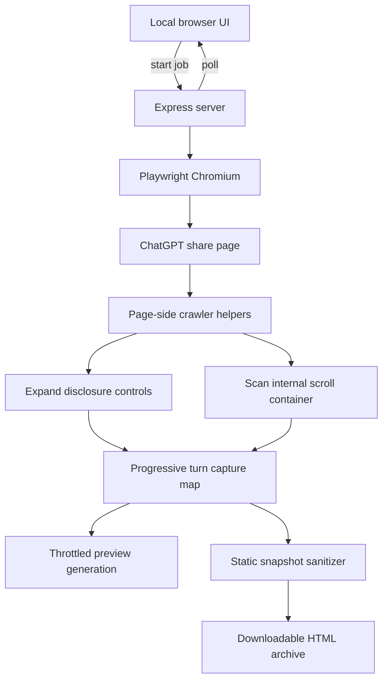

# ChatGPT Conversation Crawler

A local Node.js/Playwright application that turns a ChatGPT **shared conversation** into a readable, script-free static HTML archive.

It is designed for long conversations that ordinary browser **Save page** / MHTML capture can miss because ChatGPT lazily mounts content, virtualizes conversation turns, and keeps reasoning/tool sections behind user-visible disclosure controls.

For example, ChatGPT can expose a collapsed row like:

```html
<button
  type="button"
  aria-label="Implemented ellipse-based horizon detection and inspected detection block indentation"
  aria-controls="_r_19h_"
  aria-expanded="false">
</button>
```

The generated `aria-label` is not the important part. The crawler uses the structural disclosure state (`aria-expanded="false"` plus `aria-controls`) inside conversation turns, opens the control, waits for its content to mount, and retains the richer version of the turn.

> [!IMPORTANT]
> This project captures content that the ChatGPT **share page actually exposes to an ordinary browser** after normal scrolling and user-visible expansion. It does not recover private model chain-of-thought, hidden application state, React internals, account-only data, or network payloads that are not exposed by the shared page.

## Features

- Accepts only `https://chatgpt.com/share/...` URLs.
- Opens the share in a clean Playwright-controlled Chromium browser.
- Detects ChatGPT's internal vertical scroll container instead of assuming `window` is the scroller.
- Scans the conversation in multiple directions to trigger lazy loading and virtualization boundaries.
- Progressively retains turns so content is not lost when ChatGPT unmounts older DOM nodes.
- Expands native `<details>` elements.
- Expands conversation disclosures with `aria-expanded="false"` and `aria-controls` regardless of generated label text.
- Expands parent controls such as **Worked for ...**, **Thought**, **Thinking**, and **Reasoning** even when they do not have `aria-controls` themselves.
- Avoids obvious menu controls such as `aria-haspopup` and `[role="menuitem"]`.
- Preserves semantic code markup such as `<pre>` and `<code>`.
- Retains the richest version of each virtualized conversation turn encountered during the crawl.
- Provides live progress, persistent scanning/oldest/expansion diagnostics, heartbeat monitoring, and an optional separate preview window.
- Supports cancellation.
- Includes a dedicated oldest-message convergence phase for long conversations.
- Produces a static, script-free HTML file suitable for offline reading or further conversion.
- Includes setup/start scripts for **Windows, Linux, and macOS**.
- Publishes finished versions automatically as GitHub Releases with a cross-platform ZIP asset.

## Requirements

- Windows, Linux, or macOS
- Node.js **20 or newer**
- npm for the active Node.js installation
- Internet access while crawling the ChatGPT share URL
- Enough memory for Chromium plus the progressively retained conversation HTML

## Downloading a release

Finished versions are published as formal GitHub Releases. Each release includes a cross-platform ZIP containing the source plus the Windows/Linux/macOS launchers.

Open the repository's **Releases** page and download the versioned asset, for example:

```text
chatgpt-conversation-crawler-v1.4.1.zip
```

The release workflow reads the version from `package.json`, creates the `vX.Y.Z` release only if it does not already exist, and attaches a ZIP built from that exact release commit.

---

## Quick start on Windows

### 1. Install Node.js

Install Node.js 20+ with npm included, then extract the release ZIP.

### 2. One-time setup

Double-click:

```text
setup-windows.bat
```

The script:

1. finds the active `node.exe`;
2. resolves the `npm.cmd` installed alongside that Node installation rather than trusting an accidental project-local npm package;
3. runs `npm install`;
4. installs Playwright Chromium by invoking Playwright's CLI directly with Node.

This defensive npm handling exists because an earlier Windows launcher could resolve npm through a broken path such as `node_modules\npm\bin\npm-cli.js`.

### 3. Start the crawler

Double-click:

```text
start-windows.bat
```

The launcher starts the application directly with:

```text
node server.mjs
```

and attempts to open:

```text
http://localhost:3000
```

It deliberately does **not** call `npm start` at runtime.

---

## Quick start on Linux

Extract the release ZIP, open a terminal in the extracted directory, then run:

```bash
./setup-linux.sh
./start-linux.sh
```

The scripts are stored as executable files in Git. If your archive/unzip tool strips executable permissions, restore them with:

```bash
chmod +x setup-linux.sh start-linux.sh
```

### What `setup-linux.sh` does

The setup script:

1. verifies that Node.js 20+ is available;
2. verifies that npm is available;
3. runs `npm install`;
4. installs Playwright Chromium;
5. on systems with `apt-get`, attempts Playwright's `install --with-deps chromium` so required shared libraries are installed as well;
6. on non-apt distributions, installs the Chromium package and leaves distribution-specific shared-library installation to the system package manager if Playwright reports anything missing.

Installing Linux system packages may require sudo/root privileges. On Debian/Ubuntu-family systems, Playwright may request elevation during the `--with-deps` step.

### What `start-linux.sh` does

It validates Node and installed project dependencies, starts `node server.mjs`, and tries to open the local UI using `xdg-open` or `gio`.

A graphical browser opener is optional. On a headless Linux machine the server still starts and prints the URL; open it manually from a browser that can reach the machine.

Default URL:

```text
http://localhost:3000
```

---

## Quick start on macOS

Extract the release ZIP, open Terminal in the extracted directory, then run:

```bash
./setup-macos.sh
./start-macos.sh
```

If executable permissions were removed while extracting the ZIP:

```bash
chmod +x setup-macos.sh start-macos.sh
```

### What `setup-macos.sh` does

The script:

1. verifies Node.js 20+;
2. verifies npm;
3. runs `npm install`;
4. installs Playwright Chromium.

If Node.js is not installed, use the installer from nodejs.org or a package manager such as Homebrew, then rerun the setup script.

### What `start-macos.sh` does

It validates the installation, launches `node server.mjs`, and uses macOS `open` to open the local UI in the default browser.

Default URL:

```text
http://localhost:3000
```

---

## Custom port

The server reads `PORT`. The Linux/macOS launchers use the same environment variable when opening the browser.

For example:

```bash
PORT=3100 ./start-linux.sh
```

or:

```bash
PORT=3100 ./start-macos.sh
```

On Windows, set `PORT` before launching the server manually if you need a non-default port.

## Manual setup on any platform

If you do not want to use a platform launcher:

```bash
npm install
node node_modules/playwright/cli.js install chromium
node server.mjs
```

On Linux, Chromium may additionally require OS shared libraries. On supported apt-based systems:

```bash
node node_modules/playwright/cli.js install --with-deps chromium
```

Then open `http://localhost:3000`.

## Usage

1. In ChatGPT, use **Share** on the conversation you want to archive.
2. Copy the generated URL, for example:

   ```text
   https://chatgpt.com/share/...
   ```

3. Paste it into **ChatGPT Conversation Crawler**.
4. Select **Start archive**.
5. Keep the main status page open while the crawler works.
6. If you want to inspect captured content during the run, wait for **Open live preview** to become enabled and click it. The preview window is **not opened automatically**.
7. When the job reaches **Complete**, download the generated static HTML file.

For long conversations the crawl can take substantial time because it repeatedly scrolls, waits for asynchronous rendering, expands mounted disclosures, revisits the oldest edge until it converges, and progressively preserves turns that ChatGPT later virtualizes out of the live DOM.

## Understanding the progress page

The UI intentionally separates several kinds of state instead of forcing them through one changing message line.

### Phase

The large phase heading is the coarse lifecycle state, for example:

```text
Launching Chromium
Loading share
Preparing crawler
Scanning conversation
Verifying oldest messages
Final expansion sweep
Building final static page
Complete
```

### Detail

**Detail** explains the current operation, wait, transition, or noteworthy state that is not already represented by the persistent traversal/expansion fields.

Examples:

```text
Opening the ChatGPT share page and waiting for its initial render.
Capturing mounted turns and opening disclosures as they appear.
Live-preview rebuilding is paused while the oldest edge is probed for asynchronously prepended turns.
Sanitizing retained turns and assembling the downloadable HTML archive.
```

Detail deliberately does **not** repeat the pass number, scan direction, step number, oldest retained ID, or disclosure label.

### Scanning

**Scanning** is reserved for traversal state only.

During an ordinary scan it looks similar to:

```text
Pass 2/3 ↑ · step 47 · 31.8% mounted range
```

When a directional endpoint is being checked for stability, it can add:

```text
· edge stable 2/3
```

During oldest-message verification it looks similar to:

```text
Oldest-edge probe · check 18 · stable 7/12 · mounted first conversation-turn-12
```

Before traversal begins it says:

```text
Not started
```

After all traversal/oldest-edge work completes it says:

```text
Complete — 3 passes + oldest-edge convergence
```

The current mounted-range percentage is **diagnostic only**. ChatGPT can mount or unmount content while the crawler moves, so the known scroll range can grow or shrink during a run. It is not an overall completion percentage.

### Oldest retained

**Oldest retained** is the oldest `conversation-turn-*` ID currently stored in the progressive capture map.

This is persistent across phase changes, so when older content is discovered you can see the value move toward earlier turn IDs.

### Expanding

**Expanding** shows the current or most recent disclosure expansion, including the turn ID and the user-facing/generated disclosure label when available.

Expansion reporting does not overwrite Detail or Scanning.

### Progress bar

The progress bar is a coarse visualization:

- before traversal starts: indeterminate;
- during scan passes: derived from pass plus the currently mounted scroll position;
- after traversal/oldest-edge convergence: held near completion while final expansion/snapshot work runs;
- after the archive is complete: 100%.

The main phase sequence is:

```text
Preparing crawler
        ↓
Pass 1/3 — downward
        ↓
Pass 2/3 — upward
        ↓
Verifying oldest messages
        ↓
Pass 3/3 — downward
        ↓
Final expansion sweep
        ↓
Building final static page
        ↓
Complete
```

The dashboard also reports:

- conversation turns retained;
- disclosures confirmed expanded;
- attempted expansion clicks;
- `<pre>` blocks retained;
- `<code>` elements retained;
- unconfirmed expansion failures;
- worker heartbeat age;
- age of the last substantive progress event.

### Worker heartbeat vs. substantive progress

These signals are intentionally separate.

**Worker heartbeat** means the Node/Chromium job is still responding.

**Last substantive progress** means something meaningful changed, such as a phase transition, traversal position, newly retained turn, expansion, or code-block count change.

A recent heartbeat with an older progress timestamp can be normal while ChatGPT is asynchronously mounting content or while the crawler is waiting for a convergence condition. A stale heartbeat is a stronger indication that Chromium or Node may actually be stuck.

## How the crawler works



### 1. URL validation

`server.mjs` accepts only HTTPS URLs on `chatgpt.com` / `www.chatgpt.com` whose path begins with `/share/`.

This is intentional: the local server is not intended to be an arbitrary URL fetcher or local-network proxy.

### 2. Chromium renders the real share page

The server launches Playwright Chromium with JavaScript enabled and loads the shared page. A plain frontend `fetch()` from localhost cannot reliably load and inspect ChatGPT's cross-origin application DOM, and the conversation is dynamically rendered anyway.

The crawler uses a clean Playwright browser context. It does not import the user's normal ChatGPT login session.

### 3. Conversation-turn scoping

The crawler focuses on:

```css
section[data-testid^="conversation-turn-"]
```

This keeps expansion logic inside actual conversation content rather than indiscriminately clicking navigation, account, model-selection, or other surrounding interface controls.

### 4. Disclosure expansion

There are two important categories.

#### Controlled disclosures

Within a conversation turn, a control is eligible when it is collapsed and structurally controls content:

```html
<button
  aria-expanded="false"
  aria-controls="_r_19h_"
  aria-label="Implemented ellipse-based horizon detection and inspected detection block indentation">
</button>
```

The crawler does not require labels to contain `Thought`, because generated labels can describe arbitrary activity. Controls with menu semantics such as `aria-haspopup` are excluded.

#### Parent reasoning controls

Some parent rows look more like:

```html
<button aria-expanded="false">
  Worked for 3m 38s
</button>
```

They may not expose `aria-controls`. Opening one can cause React to mount a nested reasoning/tool tree, so the crawler recognizes parent labels beginning with forms of:

- `Worked for`
- `Thought`
- `Thinking`
- `Reasoning`

After opening a parent, it rescans newly mounted content and expands controlled rows inside it.

Each attempted click is followed by a wait and confirmation. Controls that cannot be confirmed open after repeated attempts are recorded as failures instead of silently counted as successful.

### 5. Progressive capture protects against virtualization

Long ChatGPT conversations can virtualize their DOM. A turn visible near the top may be removed from the live document after the browser scrolls far away.

The crawler therefore does **not** wait until the end and simply copy the currently mounted DOM.

Every encountered conversation turn is cloned into a capture map keyed by its `conversation-turn-*` ID. When the same turn is encountered later in a richer state, the stored copy is replaced.

The richness score favors, in order:

1. no remaining detected collapsed disclosures;
2. more `<pre>` blocks;
3. more `<code>` elements;
4. more text;
5. a larger retained HTML representation.

This is why a turn first encountered in collapsed form can later be replaced with a version containing its mounted tool output or code block.

### 6. Lazy-loading scan strategy

The crawler finds the scrollable ancestor around `#thread` / `main` rather than assuming the document itself scrolls.

The sequence is:

1. **Pass 1 — downward**: discover content moving toward the currently known bottom.
2. **Pass 2 — upward**: return through virtualized history with smaller upward steps.
3. **Verifying oldest messages**: repeatedly re-enter the top edge until old-message loading converges.
4. **Pass 3 — downward**: traverse everything discovered after the oldest-message probe.
5. **Final expansion sweep**: open remaining mounted disclosures and capture one final time.

Directional scans permit up to 1,200 steps. Upward motion uses smaller increments than downward motion to reduce the risk of skipping lazy-loading boundaries.

## Oldest-message convergence

A previous implementation could reach `scrollTop = 0`, observe a few unchanged samples, and move on before ChatGPT asynchronously prepended all old turns.

The crawler has a dedicated **Verifying oldest messages** phase. At the top edge it monitors a signature containing:

- oldest conversation-turn ID retained so far;
- first conversation-turn ID currently mounted;
- retained turn count;
- current scroll height;
- retained `<pre>` count;
- retained `<code>` count;
- expansion click count;
- confirmed expansion count.

It requires **12 consecutive unchanged top checks** before considering the oldest region converged. If any signal changes, the quiet counter resets.

Between checks it moves a short distance away from the top and back again. This re-crosses the edge and can retrigger `IntersectionObserver` or virtualizer logic that may not fire again if the browser simply remains parked at `scrollTop = 0`.

Expensive preview reconstruction is paused during this phase so Chromium can concentrate on mounting old turns.

## Live preview

The crawler generates preview HTML periodically in the background, but the browser **does not automatically open a preview window when a job starts**.

The **Open live preview** button becomes enabled once a preview is available. Clicking it opens a separate preview window for the current job.

The preview is generated from the progressive capture map rather than whichever subset of turns happens to be mounted in ChatGPT at that instant.

Preview reconstruction is throttled because serializing a very large accumulated conversation is expensive. The final downloaded archive is built again after crawling completes.

## Static export

`src/snapshot.mjs` turns retained turn clones into a script-free reading document rather than a replay of the ChatGPT application.

The exporter:

- sorts retained turns by conversation-turn number;
- removes scripts and application-only interactive content;
- removes dialogs, menus, forms, inputs, canvases, iframes, and SVG elements;
- removes nodes still hidden with `hidden` / `aria-hidden="true"`;
- normalizes links;
- converts useful reasoning/status labels into static text;
- removes copy/model/action buttons that are meaningless in a static archive;
- strips most application attributes and event-oriented markup;
- preserves prose, lists, tables, headings, images, `<pre>`, and `<code>`;
- adds source URL, archive time, turn count, and expansion diagnostics.

### Images

Images remain as resolved external URLs. They are **not** embedded as base64/data URLs in the HTML.

This keeps output files smaller, but an image can stop displaying later if its source URL expires or becomes unavailable.

## Project layout

```text
.
├── package.json
├── server.mjs
├── setup-windows.bat
├── start-windows.bat
├── setup-linux.sh
├── start-linux.sh
├── setup-macos.sh
├── start-macos.sh
├── public/
│   ├── index.html
│   └── preview.html
├── src/
│   ├── crawler.mjs
│   └── snapshot.mjs
└── .github/
    └── workflows/
        └── release.yml
```

### Platform launchers

- `setup-windows.bat` / `start-windows.bat` — Windows setup/start path with defensive npm resolution.
- `setup-linux.sh` / `start-linux.sh` — Linux setup/start path, including Playwright dependency handling on apt-based distributions.
- `setup-macos.sh` / `start-macos.sh` — macOS setup/start path using the default `open` command for the local UI.

### `server.mjs`

- validates share URLs;
- creates and tracks in-memory archive jobs;
- owns Playwright Chromium;
- records heartbeat and persistent progress fields;
- tracks traversal completion independently from final archive completion;
- throttles preview generation;
- serves status, preview, cancellation, and final-download endpoints.

### `src/crawler.mjs`

Runs page-side capture helpers and orchestrates scrolling, expansion, progressive turn retention, scan phases, cancellation checks, and oldest-message convergence.

### `src/snapshot.mjs`

Transforms the progressive capture map into the readable static HTML output.

### `public/index.html`

The local control/status UI. It starts jobs, polls the server for live progress, and opens the live preview only when explicitly requested.

### `public/preview.html`

The separate live preview window.

## HTTP endpoints

| Method | Endpoint | Purpose |
|---|---|---|
| `POST` | `/api/archive/start` | Start an archive job |
| `GET` | `/api/archive/status/:id` | Poll phase, counters, heartbeat, traversal completion, and persistent status fields |
| `GET` | `/api/archive/preview/:id` | Retrieve the latest preview HTML |
| `GET` | `/api/archive/download/:id` | Download the final HTML after completion |
| `POST` | `/api/archive/cancel/:id` | Request cancellation |

Jobs and generated HTML are held **in memory**. Restarting Node discards active/completed job state that has not already been downloaded.

## Security model

This tool is intended to run on a trusted machine for a URL deliberately supplied by the user.

Relevant choices:

- only HTTPS `chatgpt.com/share/...` URLs are accepted;
- arbitrary hosts are rejected, limiting SSRF/general-fetch behavior;
- Playwright uses a clean browser context rather than the user's browser profile;
- the final HTML contains no copied ChatGPT scripts;
- the local server has no authentication layer because it is designed as a local utility.

Do not expose the local server port to untrusted networks.

## What the project does not do

It does not:

- authenticate into a private ChatGPT account;
- bypass workspace/share restrictions;
- recover content that the share page does not expose to the browser;
- extract private chain-of-thought or model-internal reasoning;
- inspect hidden React state or private API payloads to manufacture missing content;
- preserve ChatGPT as an interactive application;
- guarantee externally hosted images remain available indefinitely;
- guarantee compatibility with future ChatGPT DOM changes without maintenance.

## Troubleshooting

### Windows: `Cannot find module ... node_modules\npm\bin\npm-cli.js`

Use the current Windows scripts. `start-windows.bat` starts the server directly with Node. `setup-windows.bat` resolves the npm installation paired with the active Node executable.

### Linux: Playwright reports missing shared libraries

First rerun:

```bash
./setup-linux.sh
```

On apt-based systems it attempts:

```bash
node node_modules/playwright/cli.js install --with-deps chromium
```

On other distributions, install the missing libraries named in Playwright's error using your distribution package manager.

### macOS/Linux: `Permission denied` when running a `.sh` file

Restore executable permissions:

```bash
chmod +x setup-linux.sh start-linux.sh setup-macos.sh start-macos.sh
```

Then run the platform-appropriate scripts again.

### Playwright says Chromium is missing

Run the platform setup script, or manually:

```bash
node node_modules/playwright/cli.js install chromium
```

### UI is active but counters have not changed

Check **Worker heartbeat**.

- recent heartbeat + older substantive-progress time: the crawler is alive and may be waiting on ChatGPT or a convergence check;
- stale heartbeat: Chromium/Node may actually be stalled.

Also inspect **Detail**, **Scanning**, **Oldest retained**, and **Expanding**. Open the live preview manually if you want to inspect the retained content itself.

### Oldest messages are still missing

Watch the **Verifying oldest messages** phase and confirm the oldest-edge stability count reaches `12/12`.

If the first retained turn is still not the true beginning, ChatGPT may have changed lazy-loading/virtualizer behavior. Capture the relevant saved DOM pattern and adjust the scroll-root/convergence logic rather than simply forcing hidden HTML visible.

### A code/tool section remains collapsed

The crawler expands controls inside conversation turns that look structurally like disclosures or recognized reasoning parents. It intentionally avoids blindly clicking every button on the page.

Inspect whether the control exposes `aria-expanded`, `aria-controls`, or another user-facing disclosure relationship. Frontend changes can require updating `isDisclosure()` in `src/crawler.mjs`.

## Development

Start manually:

```bash
npm start
```

Syntax-check the main JavaScript modules:

```bash
node --check server.mjs
node --check src/crawler.mjs
node --check src/snapshot.mjs
```

Syntax-check Unix launchers:

```bash
bash -n setup-linux.sh start-linux.sh setup-macos.sh start-macos.sh
```

When changing crawler behavior, test at least:

1. a short conversation with no reasoning/tool disclosures;
2. `<pre><code>` content;
3. a collapsed `aria-controls` row with an arbitrary generated `aria-label`;
4. a collapsed **Worked for ...** parent that mounts nested disclosures;
5. a long conversation that virtualizes turns;
6. a conversation where older turns appear asynchronously after repeatedly reaching the top;
7. cancellation during a long scan;
8. manual live preview while counters change;
9. status semantics during launch, traversal, oldest-edge verification, final expansion, final snapshot, and completion.

## Release automation

`.github/workflows/release.yml` runs on pushes to `main` and can also be started manually from GitHub Actions.

It:

1. reads `package.json` version;
2. maps it to tag `vX.Y.Z`;
3. checks whether that release already exists;
4. leaves an existing release untouched;
5. creates a ZIP from the exact commit when the version is new;
6. creates the GitHub Release with generated release notes;
7. attaches the ZIP as **Cross-platform source ZIP**.

Therefore, a finished version is committed first and the `package.json` version bump is pushed only after the release contents are ready. That final version bump causes the release workflow to publish the complete state.

## Version history

### v1.0.0 — initial share archiver

- Initial local Express/Playwright implementation.
- Restricted input to ChatGPT share URLs.
- Basic lazy scrolling and conservative disclosure expansion.
- Static HTML export with code blocks retained.

### v1.1.0 — disclosure structure and virtualization

- Switched from label-only expansion to conversation-scoped structural disclosure detection.
- Added arbitrary generated-label handling for `aria-controls` disclosures.
- Added **Worked for / Thought / Thinking / Reasoning** parent expansion.
- Switched to ChatGPT's internal scroll container.
- Added multi-direction scanning and progressive turn capture.
- Added Windows launchers.

### v1.1.1 — Windows launcher fix

- Fixed startup when npm resolved to a broken project-local package.
- Runtime now calls `node server.mjs` directly.
- Setup resolves npm alongside the active Node installation.

### v1.2.0 — live status and preview

- Added tracked in-memory jobs.
- Added phase/pass/counter polling, heartbeat, preview, cancellation, and deferred download.

### v1.3.0 — oldest-message convergence

- Raised scan ceiling and reduced upward step size.
- Added **Verifying oldest messages**.
- Requires 12 unchanged top signatures before declaring convergence.
- Re-enters the top edge to retrigger lazy loaders.
- Pauses expensive preview generation during the probe.

### v1.3.1 — persistent activity diagnostics

- Keeps **Scanning**, **Oldest retained**, and **Expanding** visible independently.
- Retains a separate general **Detail** line.
- Replaced outdated scroll-percentage wording with convergence-oriented diagnostics.

### v1.4.0 — Linux and macOS launchers

- Added `setup-linux.sh` and `start-linux.sh`.
- Added Linux Playwright system-dependency handling for apt-based distributions with a browser-only fallback elsewhere.
- Added `setup-macos.sh` and `start-macos.sh`.
- Added platform-aware default-browser opening.
- Added Node 20/dependency validation to Unix launchers.
- Release ZIP is labeled cross-platform rather than Windows-only.

### v1.4.1 — status semantics and opt-in preview

- Restricted **Scanning** to traversal and oldest-edge state.
- Kept **Detail** for operation/wait/transition messages instead of duplicating pass information.
- Made disclosure reports update only **Expanding**.
- Added mounted-position and endpoint-stability information to the Scanning line.
- Added explicit traversal-complete state and cleared stale pass/direction/step values before finalization.
- Made the progress UI prioritize completed/finalizing states over stale scan data.
- Stopped automatically opening the live preview when an archive starts; preview opening is user initiated.

## Reconstructed repository history

The repository was assembled after the application had already been iterated as versioned ZIP packages during the development conversation.

- The v1.0 commit contains the original initial source snapshot.
- Later historical commits preserve the tested feature progression and version boundaries in a cleaned modular layout (`src/crawler.mjs` + `src/snapshot.mjs`).
- The historical commits should be read as a faithful reconstruction of the development sequence, not a claim that every later intermediate file is byte-for-byte identical to previously distributed ZIPs.

## Maintenance note

ChatGPT's frontend is not a stable public DOM API. Selectors, accessibility attributes, virtualizer behavior, and disclosure structure may change.

When something breaks, prefer adapting to **user-facing structural semantics**—conversation turn boundaries, `aria-expanded`, `aria-controls`, visible parent disclosures, and mounted-scroll behavior—rather than generated class names.
